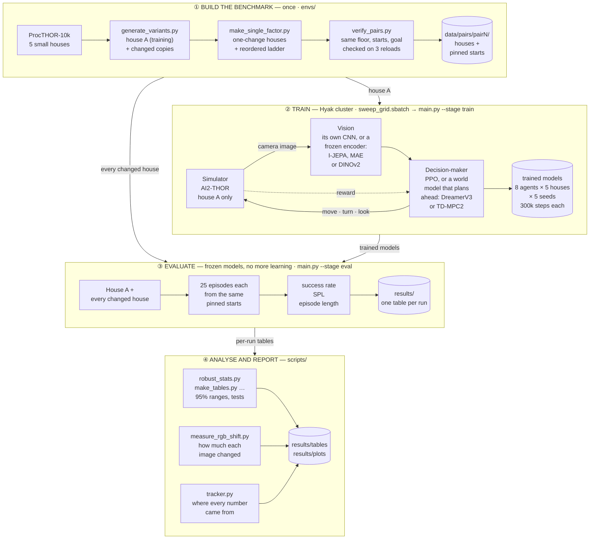

# NSL Zero-Shot Visual Transfer Baselines (ProcTHOR)

How much do embodied RL agents and world models lose when the room they were
trained in is **repainted**, while everything that matters for the task stays
exactly the same?

Each agent learns to find one object (a bed, a fridge or a television) in one
ProcTHOR house. It is then tested, frozen, in copies of that house that differ
**only in appearance**: same floor plan, same object positions, same starting
spots. Appearance is changed step by step, one factor at a time, and in a ladder
ordered from least to most damaging, to find exactly where each kind of agent
breaks (the **visual-binding problem**).

Neural Systems Lab, UW — baseline track for the masking + CSCG architecture project.

## How it works (the whole system on one page)



**① Build the benchmark (once).** Five small houses (pairs P0–P4) come from
ProcTHOR-10k. In each, *house A* is the house agents train in. Every other house
is a copy of it with only its appearance changed, in three families:

- **Cumulative ladder:** L1 changes the wall, floor and ceiling materials, the
  lighting and the sky → L2 also changes the look of every object (L2noT: every
  object except the goal) → L3 also adds small clutter objects on surfaces.
- **One change at a time:** each of those changes applied to house A on its own.
- **Reordered ladder:** the same changes, stacked from least to most damaging:
  clutter → + lighting and sky → + object looks → + walls, floor and ceiling.

Every copy is checked in the simulator on three separate loads: the walkable
floor, the 25 evaluation starting spots and the number of goal objects must all
match house A. Nothing in any house can be pushed around.

**② Train (on the UW Hyak cluster).** Every agent trains in house A only, for
300,000 steps, with 5 seeds in each of the 5 houses. At every step the simulator
returns a 128×128 camera image; the agent's *vision* turns it into features; its
*decision-maker* picks a move (forward, turn, look up or down); and the simulator
returns a reward (a small cost per step, a bonus for getting closer, +10 for
reaching the goal).

**③ Evaluate (no more learning).** Each trained agent is run in house A and in
every changed copy: 25 episodes per house, all from the same pinned starting
spots, which come from a fifth of the floor never used in training. An episode
succeeds if the agent gets within 1.5 m of the goal and can see it, within 200
steps.

**④ Analyse.** Scripts turn the per-run tables into success rates with 95%
ranges, comparisons between agents, measurements of how much each image changed,
and figures. `tracker.py` records where every number came from (commit, job,
settings).

**The eight agents**

| Agent | Vision | Decision-maker |
|---|---|---|
| PPO | CNN learned from scratch | PPO (model-free) |
| PPO+Aug | same, trained on colour-jittered images | PPO |
| PPO+I-JEPA | frozen I-JEPA encoder (ImageNet) | PPO, small trained head |
| PPO+MAE | frozen MAE encoder (ImageNet) | PPO, small trained head |
| PPO+DINOv2 | frozen DINOv2 encoder (LVD-142M) | PPO, small trained head |
| DreamerV3 | learned inside the world model, which also redraws the image | world model; learns its policy by imagining |
| TD-MPC2 | learned inside the world model, no redrawing | world model; plans ahead at every step |
| TD-MPC2+DINOv2 | frozen DINOv2 encoder | TD-MPC2 |

## Requirements

- Apple Silicon Mac (developed on M4, 32 GB) with **Rosetta 2**
  (AI2-THOR's macOS Unity build is x86_64: `softwareupdate --install-rosetta --agree-to-license`)
- ~5 GB free disk (conda env + ProcTHOR-10k dataset + Unity build)
- Network access on first run (PyPI, `ai2thor-pypi.allenai.org`, dataset download)

## One-command setup (M4 / Apple Silicon)

```bash
bash setup.sh
```

This installs Miniforge if needed, creates the conda env **`nsl`
(Python 3.9)**, installs the pinned arm64 stack (`torch 2.2.2` with MPS,
`stable-baselines3 2.3.2`, `gymnasium 0.29.1`, `prior`), installs **AI2-THOR
from AllenAI's private index at the ProcTHOR-pinned commit**
(`0+391b3fae...`), verifies MPS is active, and writes `requirements.lock.txt`.

Python 3.9 is deliberate: it is the version the ProcTHOR-era tooling
(`procthor`, `prior`, the pinned AI2-THOR build) was built and tested against,
and every pinned package above ships py3.9 arm64 wheels.

## Run the experiment

```bash
conda activate nsl

# fast end-to-end mechanics check (~minutes; tiny step counts)
python main.py --smoke

# full PPO transfer experiment (env generation -> train on A -> zero-shot eval on B)
python main.py

# PPO + train-time photometric augmentation (the "why not just augment?" baseline;
# identical recipe/budget to ppo — only the training observations are jittered)
python main.py --baseline ppo_aug

# full DreamerV3 transfer experiment (same protocol, vendored NM512 world model)
python main.py --baseline dreamerv3
tensorboard --logdir results/logs/dreamerv3   # live training curves

# individual stages
python main.py --stage generate          # build the two visual variants only
python main.py --stage train             # train the selected baseline on variant A
python main.py --stage eval              # frozen-policy eval on A and B
python main.py --total-steps 300000      # override the training budget
```

First `train`/`eval` run downloads the AI2-THOR Unity build (~0.5 GB) and
opens a small Unity window — this is normal on macOS (no headless mode).

The commands above run locally on the original single house pair and are for
checking that the pipeline works. **Every reported number comes from the Hyak
cluster**: `scripts/slurm/sweep_grid.sbatch <agent> 300000` trains one agent in
all 5 houses × 5 seeds, and `scripts/slurm/factor_eval.sbatch` re-evaluates
trained models in the one-change and reordered houses. See
`scripts/slurm/README.md`.

## Project layout

```
config.py                     # single source of truth: paths + every agent's settings
setup.sh                      # one-command local environment setup (Apple Silicon)
setup_hyak.sh                 # the same for the Hyak cluster (Linux/CUDA)
main.py                       # pipeline: generate -> train -> evaluate
envs/
  procthor_env.py             # the ObjectNav task over one ProcTHOR house
  task_setup.py               # one task configuration shared by every agent
  generate_variants.py        # house A + the cumulative ladder (L1, L2noT, L2, L3)
  scan_safe_assets.py         # finds object swaps that keep the walkable floor identical
  prune_l3.py                 # removes clutter that falls or blocks the floor
  make_single_factor.py       # one-change houses + the reordered ladder
  verify_pairs.py             # simulator checks: same floor, starts and goal count
  frozen_encoder.py           # frozen I-JEPA / MAE / DINOv2 as the agent's observation
  augmentation.py             # colour jitter for PPO+Aug (training only)
models/
  common.py                   # interface shared by all agents
  dreamer_v3/                 # DreamerV3: vendored NM512 implementation + adapter
  td_mpc2/                    # TD-MPC2: vendored nicklashansen implementation + adapter
scripts/
  train_ppo.py                # PPO-family training in house A
  evaluate_transfer.py        # frozen-model evaluation in every house
  make_tables.py              # per-agent and per-house tables
  robust_stats.py             # 95% ranges, robust averages, P(agent X beats agent Y)
  analyze_grid.py             # comparisons between agents
  test_single_change.py       # which single change does the damage
  test_target_effect.py       # does the goal object's own look matter
  measure_rgb_shift.py        # R, G, B pixel distributions of every house
  analyze_rgb_shift.py        # does a bigger colour shift bring a bigger drop?
  plot_ladder.py              # main results figure
  plot_reordered.py           # the reordered (least to most damaging) ladder
  plot_rgb_shift.py           # colour distributions; colour shift against drop
  regenerate_results.sh       # every table and figure above, in one command
  tracker.py                  # experiment tracker (results/tracker/runs.csv)
  record_rollout.py           # filmstrips of one agent across the houses
  slurm/                      # Hyak cluster job scripts + workflow README
tests/                        # contract tests (run directly: python tests/test_<name>.py)
data/pairs/pairN/             # the houses, pinned start poses, verification records
results/                      # per-run tables, tables/, plots/, tracker/
```

## Evaluation platform rule (important)

**A trained policy may only be evaluated under the renderer it trained with.**
Cluster runs use headless CloudRendering (Vulkan); macOS uses the windowed
build. Replaying a klone-trained PPO checkpoint locally scored 0.00 success on
variant A where the same checkpoint scores 0.92 on the cluster — the graphics
backend alone is a large enough appearance shift to break an appearance-bound
policy. Record rollout figures on the cluster
(`sbatch scripts/slurm/record_rollout.sbatch ppo results_seed0 10006,10020`);
use the laptop for smoke tests and code, never for reported numbers.

## MPS / performance notes

- `PYTORCH_ENABLE_MPS_FALLBACK=1` is set automatically (a few SB3 ops lack
  Metal kernels; they fall back to CPU transparently).
- The simulator (Unity, CPU-bound, under Rosetta) is the throughput
  bottleneck, not the policy net — expect ~10–30 env steps/s at 128×128.
- Keep the laptop plugged in for full training runs; ~150k steps ≈ several hours.

## Troubleshooting

- **`ai2thor` install fails**: check `https://ai2thor-pypi.allenai.org` is
  reachable; as a fallback `pip install ai2thor==5.0.0` (public PyPI) also
  supports ProcTHOR house specs.
- **Unity window never appears / times out**: first run downloads ~0.5 GB to
  `~/.ai2thor`; re-run once it completes. Grant the app screen permissions if
  macOS prompts.
- **`prior` dataset download fails**: requires git + network; re-run
  `python main.py --stage generate`.
